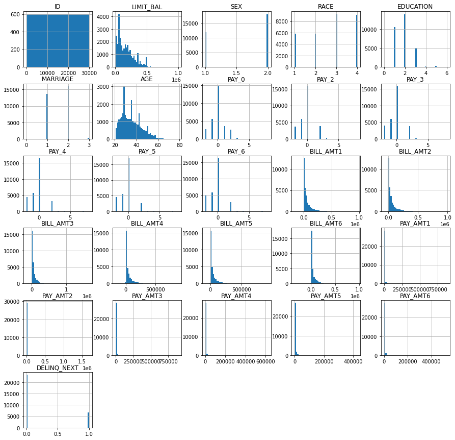
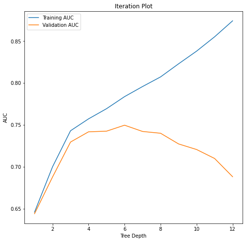

# DNSC-6301-Project-27

# Credit Line Increase Model Card

### Basic Information

* **Person or organization developing model**: Prachi Pathak, `ppathak13@gwmail.gwu.edu`,Priyanka Bhatia, `Priyanka.bhatia@gwu.edu`, Arij Ahmed Khan Lodhi, `arijahmedkhan.lodhi@gwmail.gwu.edu`, Adnan Lakdawala, `adnan.lakdawala@gwu.edu` 
* **Model date**: August 24, 2022
* **Model version**: 1.0
* **License**: MIT
* **Model implementation code**: [Group_27_Credit_Line.ipynb](Group_27_Credit_Line.ipynb) 


### Intended Use
* **Primary intended uses**: This model can be used to determine the probability that a given individual may default on their payment, and hence be used for determining who may or may not be eligible for a credit line increase. 
* **Primary intended users**: This model may be used by credit companies and other lenders who determine eligibility for credit line increases.
* **Out-of-scope use cases**: Any use beyond determining eligibility for credit line increases is out of scope.

### Training Data

* Data dictionary: 

| Name | Modeling Role | Measurement Level| Description|
| ---- | ------------- | ---------------- | ---------- |
|**ID**| ID | int | unique row indentifier |
| **LIMIT_BAL** | input | float | amount of previously awarded credit |
| **SEX** | demographic information | int | 1 = male; 2 = female
| **RACE** | demographic information | int | 1 = hispanic; 2 = black; 3 = white; 4 = asian |
| **EDUCATION** | demographic information | int | 1 = graduate school; 2 = university; 3 = high school; 4 = others |
| **MARRIAGE** | demographic information | int | 1 = married; 2 = single; 3 = others |
| **AGE** | demographic information | int | age in years |
| **PAY_0, PAY_2 - PAY_6** | inputs | int | history of past payment; PAY_0 = the repayment status in September, 2005; PAY_2 = the repayment status in August, 2005; ...; PAY_6 = the repayment status in April, 2005. The measurement scale for the repayment status is: -1 = pay duly; 1 = payment delay for one month; 2 = payment delay for two months; ...; 8 = payment delay for eight months; 9 = payment delay for nine months and above |
| **BILL_AMT1 - BILL_AMT6** | inputs | float | amount of bill statement; BILL_AMNT1 = amount of bill statement in September, 2005; BILL_AMT2 = amount of bill statement in August, 2005; ...; BILL_AMT6 = amount of bill statement in April, 2005 |
| **PAY_AMT1 - PAY_AMT6** | inputs | float | amount of previous payment; PAY_AMT1 = amount paid in September, 2005; PAY_AMT2 = amount paid in August, 2005; ...; PAY_AMT6 = amount paid in April, 2005 |
| **DELINQ_NEXT**| target | int | whether a customer's next payment is delinquent (late), 1 = late; 0 = on-time |

* **Source of training data**: GWU Blackboard, email `jphall@gwu.edu` for more information
* **How training data was divided into training and validation data**: 50% training, 25% validation, 25% test
* **Number of rows in training and validation data**:
  * Training rows: 15,000
  * Validation rows: 7,500

### Test Data
* **Source of test data**: GWU Blackboard, email `jphall@gwu.edu` for more information
* **Number of rows in test data**: 7,500
* **State any differences in columns between training and test data**: None

### Model details
* **Columns used as inputs in the final model**: 'LIMIT_BAL',
       'PAY_0', 'PAY_2', 'PAY_3', 'PAY_4', 'PAY_5', 'PAY_6', 'BILL_AMT1',
       'BILL_AMT2', 'BILL_AMT3', 'BILL_AMT4', 'BILL_AMT5', 'BILL_AMT6',
       'PAY_AMT1', 'PAY_AMT2', 'PAY_AMT3', 'PAY_AMT4', 'PAY_AMT5', 'PAY_AMT6'
* **Column(s) used as target(s) in the final model**: 'DELINQ_NEXT'
* **Type of model**: Decision Tree 
* **Software used to implement the model**: Python, scikit-learn
* **Version of the modeling software**: 
Python version: 3.7.13, 
sklearn version: 1.0.2
* **Hyperparameters**: 
```
DecisionTreeClassifier({'ccp_alpha': 0.0,
 'class_weight': None,
 'criterion': 'gini',
 'max_depth': 6,
 'max_features': None,
 'max_leaf_nodes': None,
 'min_impurity_decrease': 0.0,
 'min_samples_leaf': 1,
 'min_samples_split': 2,
 'min_weight_fraction_leaf': 0.0,
 'random_state': 12345,
 'splitter': 'best'})
```
### Quantitative Analysis

#### Correlation Heatmap
 

#### Histograms
 


#### Iteration Plots
 
 

#### Decision Tree Model
 


#### Ethical considerations

Ethical considerations:  This model initially had a moderately strong negative correlation between the prediction in delinquency on the next payment and race. Although confusion matrices were used as a bias testing check and the model was rerun to rectify the bias, caution should be used when implementing the model as the original dataset that this model was based upon has systematic biases in the data, and hence could inherently be introducing bias into the model despite corrective measures. 

This model developed using data sampled from the American population with data from 2005. An important consideration would be that due to inherent bias in the data attempting to use this model in other populations may result in the model failing to accurately predict who is more likely to default, and credit line increases may be unfairly withheld from individuals who may have otherwise not defaulted on any payments. 

This data was also sampled in 2005. Using a model developed using a 17 year old data set to make predictions today may result in several inaccuracies, especially since this data was sampled before the economic recession and changes in the financial climate after the COVID-19 pandemic. Models need to be consistently evolving so they can continue to accurately perform their prediction functions. Using newer data sets in and assessing its predictive powers would help correct any biases due to the use of old data. 

It is important to consider that models with the highest AUC may not necessarily be the best model. There are several factors to consider besides the ‘statistically strongest’ model. Even though conventional parameters of bias testing and standard thresholds of acceptable bias were met in this model, and tree depth was selected after bias testing, there will always be some tradeoff between statistical soundness and fairness when implementing the model, and these factors need to be considered when choosing how the model is developed and implemented in the real world. 


